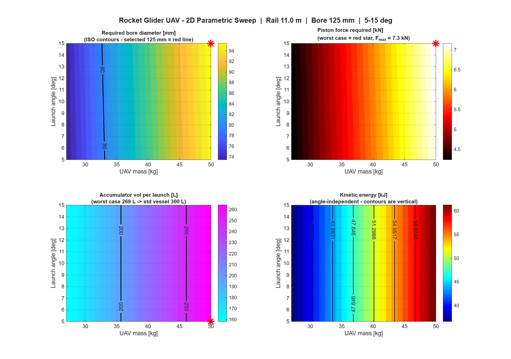

# pneumatic-launcher

A pneumatic catapult launcher for a fixed-wing UAV, sized from a 396-point 2D
parametric sweep across launch angle and vehicle mass rather than a single
assumed worst case.

Given a launch angle range and a UAV mass range, it computes the cylinder
force, bore, stroke, and accumulator volume needed at every combination,
extracts the governing condition, and sizes off-the-shelf ISO/EN catalogue
hardware to cover the full envelope with margin. Nothing is sized off one
design point unless the sweep says that point actually governs.

---

## The short version

A launcher only has to work at one condition on paper — the mass and angle
you designed for. In the field it has to work across whatever the mission
throws at it. Sizing off a single assumed worst case is a bet that you
picked the right corner of the envelope, and force doesn't scale with mass
alone: a steeper launch angle compresses the usable stroke, so a lighter
airframe at a steep angle can demand more force than a heavier one at a
shallow angle. Which combination governs isn't obvious until you check.

This project checks all of them. 11 launch angles from 5° to 15°, 36 UAV
masses from 5 kg to 49.9 kg, 396 conditions total. The governing point falls
out of the sweep rather than being assumed going in: **20 kg at 15°**, not
the heaviest mass tested. Everything downstream — bore, stroke, accumulator
volume — is sized to that point, then checked back against all 396
conditions to confirm nothing else in the grid exceeds it.

Components are pulled from ISO 6431 and EN 286-1 catalogues rather than
built custom, because a launcher that needs a bespoke cylinder is a launcher
with a six-month lead time and no field-replaceable spares.

|                                          |            |
| ---------------------------------------- | ---------- |
| Governing condition                      | **20 kg @ 15°** |
| Cylinder bore                            | **125 mm** |
| Cylinder stroke                          | **3,900 mm** |
| Accumulator                              | **1,000 L @ 10 bar** |
| Working pressure at governing point      | **5.93 bar** (< 8 bar max) |
| Buckling factor of safety                | **5.5** (target > 4.0) |
| Envelope coverage                        | **396 / 396** conditions verified |

---

## Parametric sweep results



Four panels over the angle-mass plane, one per component demand:

- **Bore diameter (top-left):** required cylinder bore across the full grid.
  Red star marks the governing point (20 kg @ 15°); the 125 mm ISO contour
  line covers the entire envelope.
- **Piston force (top-right):** force demand rises diagonally with both mass
  and angle — the governing point sits where this surface peaks.
- **Accumulator volume (bottom-left):** contours run vertical, meaning
  volume depends on mass alone, not angle — consistent with energy scaling
  as ½mv² rather than with launch geometry.
- **Kinetic energy (bottom-right):** also vertical, confirming launch angle
  affects the *force* needed to reach the target speed but not the *energy*
  stored to get there. Angle changes how hard you push; mass changes how
  much you're pushing.

---

## Install

```
git clone https://github.com/<your-username>/pneumatic-launcher.git
cd pneumatic-launcher
```

## Run it

```
cd analysis/scripts/
```

```matlab
run('pneumatic_launcher.m')
```

One script, end to end. In order, it:

1. Sweeps the full 396-point grid (11 angles × 36 masses) and computes
   force, bore demand, and accumulator volume at each condition from
   closed-form launch kinematics — no iterative solve.
2. Scans all 396 conditions and identifies the governing point.
3. Sizes ISO 6431 bore/stroke and EN 286-1 accumulator volume against the
   governing condition, with ISO 4414 safety factors applied (1.5× on
   force, 1.25× on pressure).
4. Re-checks all 396 conditions against the sized components — not just the
   one they were derived from.
5. Renders the four-panel contour plots over the angle-mass plane.
6. Exports the CSV of all 396 grid points, the worst-case summary, and a
   timestamped text summary report.

Runtime: 5–10 minutes. Requires MATLAB R2020a or later and the Statistics
and Machine Learning Toolbox.

## Reproducibility

The sweep is fully deterministic. There's no random sampling anywhere — the
396 points are a dense grid, not a Monte Carlo sample — so the same launch
angle range, mass range, and target launch speed in the config block at the
top of `pneumatic_launcher.m` always reproduce the same governing condition.
Change the grid resolution or target speed and the governing point can
shift, which is expected; the config is exposed at the top of the script
rather than buried so that can be checked directly.

---

## What is in here

### Component 1 — parametric sweep engine

`analysis/scripts/pneumatic_launcher.m`, sweep stage

For every (angle, mass) pair on an 11×36 grid, computes the force needed to
reach 55.56 m/s within the stroke budget, and the resulting bore and
accumulator demand. Closed-form kinematics, not an iterative solve — 396
points, all engineering trade-offs are visible without hiding behind
convergence tolerances.

### Component 2 — contour visualization

`analysis/scripts/pneumatic_launcher.m`, plotting stage

Four-panel contour plot over the angle-mass plane. This is what makes the
non-obvious result visible: the force peak isn't at the mass axis extreme,
it's pulled toward a mid-range mass by the 15° column, because steep angle
compresses the available stroke.

### Component 3 — worst-case extraction

`analysis/scripts/pneumatic_launcher.m`, extraction stage

Scans all 396 conditions for the one that drives the largest bore demand.
Reports mass, angle, force, and pressure at that point, so the sizing in
Component 4 traces back to one documented condition rather than an assumed
one.

Result: **20 kg @ 15°**, not the 49.9 kg maximum mass in the sweep.

### Component 4 — ISO/EN component sizing

`analysis/scripts/pneumatic_launcher.m`, sizing stage

Works backward from the governing condition to a catalogue part: bore
rounded to the nearest ISO 6431 size, stroke set by launch kinematics plus a
15% hardware reserve (70% effective stroke), accumulator rounded to the
nearest EN 286-1 size, safety factors applied per ISO 4414.

The mechanical advantage is 2:1 cable-pulley specifically because a
direct-drive 3,900 mm stroke doesn't correspond to a standard cylinder
length — geared 2:1, the actuator stroke becomes 1,250 mm, which is an ISO
6431 catalogue size. The trade is a doubled force requirement, absorbed by
the bore and safety factors.

Output: 125 mm bore, 3,900 mm stroke, 1,000 L accumulator @ 10 bar, 5.93 bar
working pressure against an 8 bar system max.

### Component 5 — envelope verification

`analysis/scripts/pneumatic_launcher.m`, verification stage

Re-runs all 396 conditions against the sized components, not just the
governing point. This is the check that catches a design that clears its
worst case on paper but fails somewhere else in the grid — 396/396 pass here.

### Component 6 — design decisions and assumptions

`docs/DESIGN_DECISIONS.md`

All assumptions behind the model — target launch speed derivation, stroke
reserve, mechanical advantage ratio, safety factor sourcing — with the
rationale for each and a sensitivity ranking, so a reviewer can tell what's
a physical constraint versus a judgment call, and which assumptions matter
most if they turn out to be wrong.

---

## Documentation

**Quick reference**
- **docs/RESULTS_SUMMARY.md** — governing point, component sizing,
  verification results, and a comparison against a fielded reference
  launcher (Robonic MC0315L)
- **docs/DESIGN_DECISIONS.md** — why a 2D sweep, why ISO parts, why 2:1
  mechanical advantage, and a sensitivity ranking of the underlying
  assumptions

**Detailed technical**
- **analysis/ANALYSIS_REPORT.md** — full methodology, physics equations,
  and verification procedure

**Data**
- `analysis/output/tables/component_sizing_results.csv` — all 396 grid
  points
- `analysis/output/tables/worst_case_summary.csv` — governing condition
  detail
- `analysis/output/reports/analysis_summary.txt` — timestamped text summary

## Things that are wrong with it

Kept here rather than buried:

- **1D launch dynamics only.** The sweep models force, velocity, and stroke
  along the rail axis; it does not model off-axis loads, crosswind during
  launch, or rail/carriage dynamics perpendicular to travel.
- **The airframe is a point mass.** Lift generated during the launch stroke
  itself isn't modeled — the target speed comes from a separate stall-margin
  calculation, but the stroke-phase kinematics don't build in lift before
  rail departure.
- **Pneumatics are idealized.** Ideal gas discharge from the accumulator,
  no valve flow restriction, line losses, or temperature drop during rapid
  discharge — a real system would deliver somewhat less force late in the
  stroke than the ideal calculation shows.
- **No fatigue or cycle-life analysis.** The 5.5 buckling factor of safety
  is a static check; repeated-launch fatigue on the rail, carriage, and cable
  system isn't evaluated.
- **5–15° and 5–49.9 kg is a design-space check, not a control envelope.**
  The sizing doesn't claim to cover conditions outside the tested grid.
- **Component selection is catalogue-level, not vendor-quoted.** Part
  numbers match the required bore and stroke from published catalogue data;
  actual lead time and cost need vendor confirmation.
- **Pressure is treated as quasi-static.** Transient pressure waves during
  rapid valve opening aren't modeled, and the gas expansion is assumed
  isothermal rather than tracking real temperature drop under discharge.
- **The rail is rigid.** No deflection under dynamic load is modeled.
- **Valid range is −20°C to +25°C.** Behavior outside that band, and piston
  seal friction beyond a lumped efficiency factor, aren't modeled.
- **No aerodynamic interaction during the ground roll.** The launch is
  modeled as if in still air — no crosswind, no dirty air effects.

Most accurate for: 5–15° launch angles, 5–49.9 kg UAV mass, isothermal
pneumatic expansion, static pressure conditions. See
**docs/DESIGN_DECISIONS.md** for the sensitivity ranking behind these.

## Layout

```
pneumatic-launcher/
├── README.md
├── LICENSE
│
├── analysis/                          MATLAB analysis
│   ├── README.md                      How to run the analysis
│   ├── ANALYSIS_REPORT.md             Full methodology
│   ├── scripts/
│   │   └── pneumatic_launcher.m       Component 1–5: sweep, sizing, verification
│   ├── data/
│   │   ├── rocket_glider_specs.json
│   │   └── iso_catalog_sizes.csv
│   └── output/
│       ├── figures/
│       │   └── contour_*.png          4-panel contour plots
│       ├── tables/
│       │   ├── component_sizing_results.csv   All 396 grid points
│       │   └── worst_case_summary.csv         Governing condition
│       └── reports/
│           └── analysis_summary.txt           Text summary
│
├── docs/                              Project documentation
│   ├── RESULTS_SUMMARY.md             Governing point, sizing, verification
│   └── DESIGN_DECISIONS.md            Rationale, trade-offs, sensitivity
│
├── results/
│   └── BILL_OF_MATERIALS.md           Component procurement list
│
└── cad/                               CAD models
```